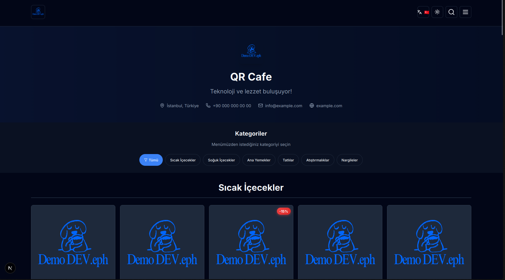
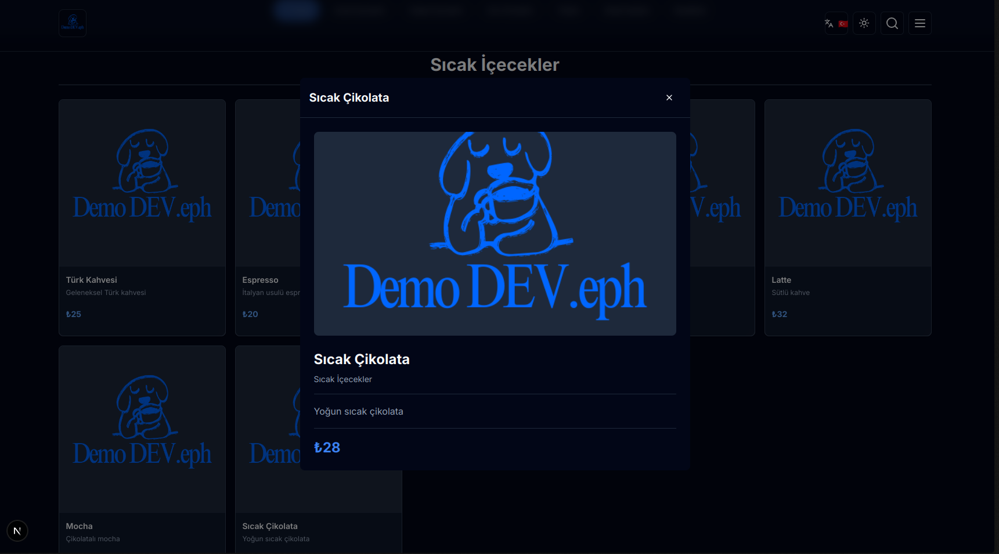
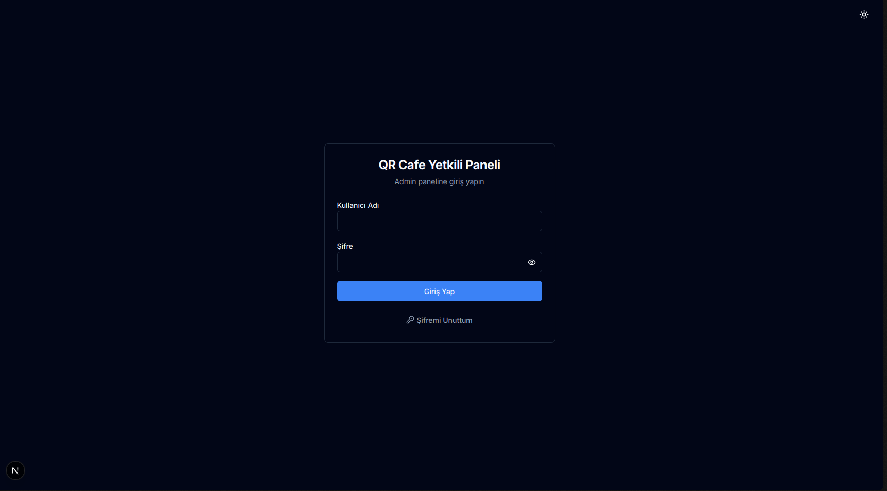
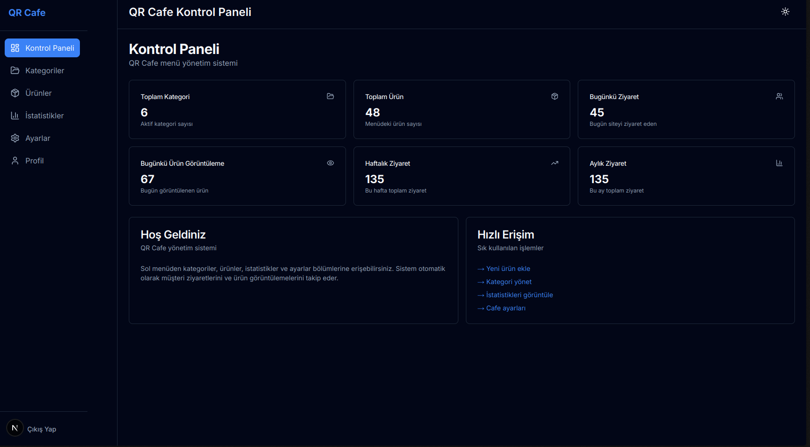
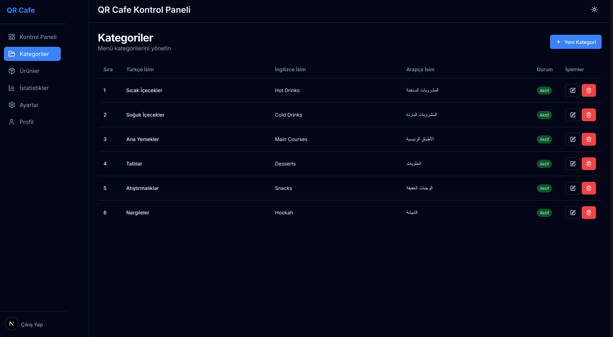
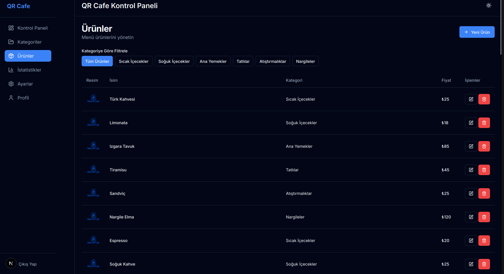
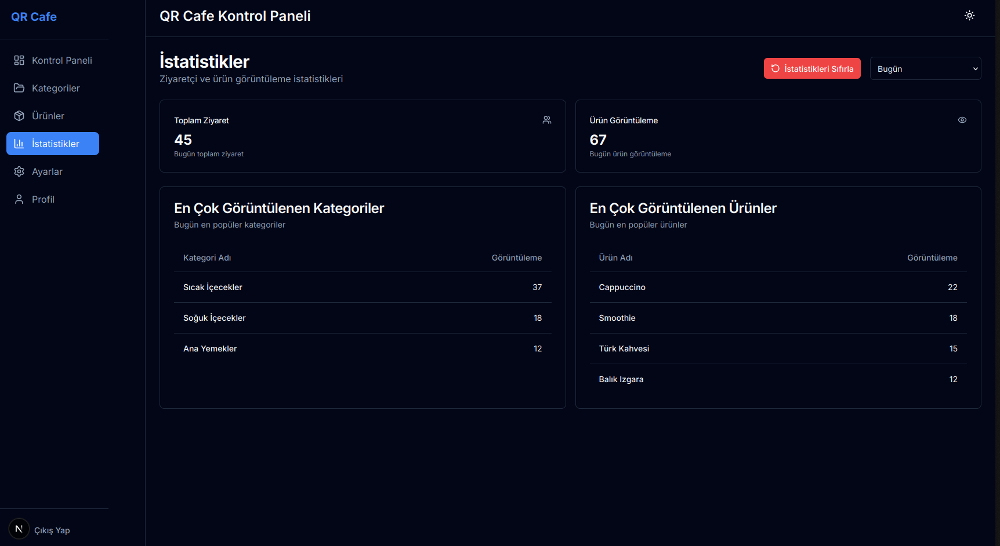
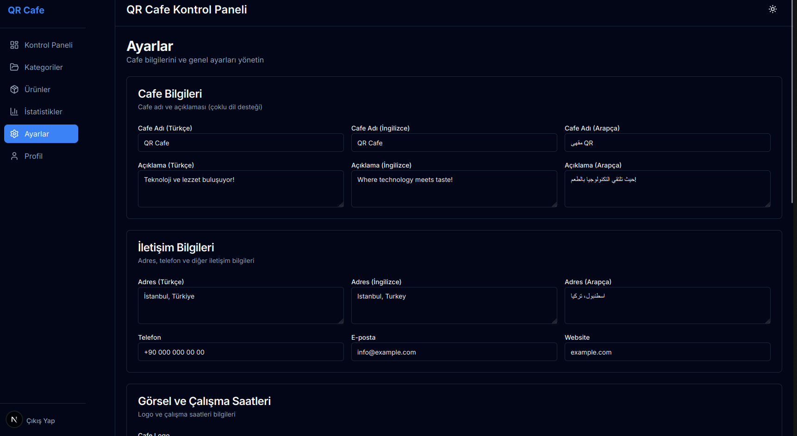
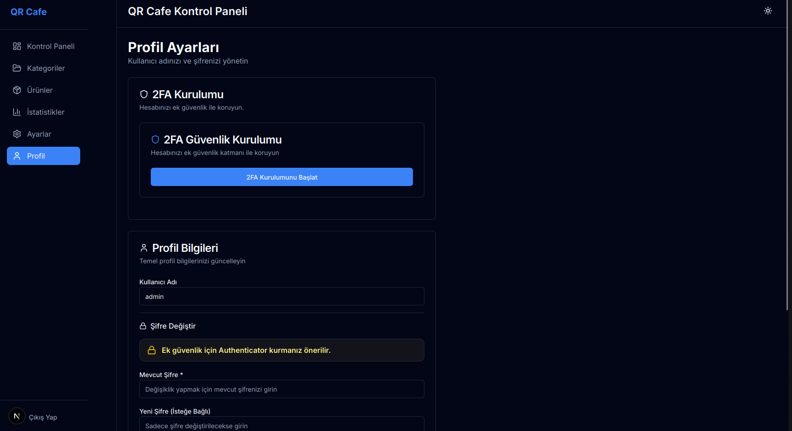
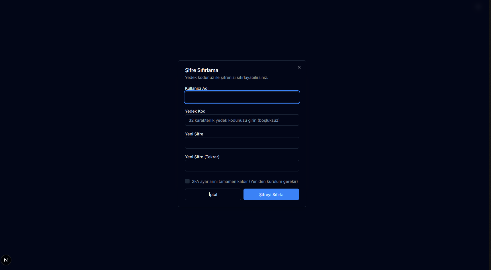

# QR Cafe Menu


[](LICENSE)

QR Cafe Menu, QR kod ile açılan dijital menü yayınlamak isteyen herkes için geliştirilmiş çok dilli bir menü ve yönetim panelidir. Kullanıcılar menüyü mobil cihazdan görüntüler; yönetici panelinden ürünler, kategoriler, fiyatlar, görseller ve iletişim bilgileri kolayca güncellenebilir.

## Özellikler

- QR ile açılabilen modern dijital menü
- Türkçe, İngilizce ve Arapça dil desteği
- Kategori ve ürün yönetimi
- Ürün görseli yükleme, WebP optimizasyonu ve logo koruması
- Ad, açıklama, adres, telefon, e-posta, web sitesi ve çalışma saatleri ayarları
- Admin paneli ve oturum koruması
- 2FA (iki adımlı doğrulama) desteği
- Ziyaret ve ürün görüntülenme analitiği
- JSON/ZIP yedek alma ve geri yükleme
- SQLite ile hızlı yerel kurulum

## Demo Admin Bilgileri

Demo kurulum için varsayılan bilgiler:

```text
Kullanıcı adı: admin
Şifre: admin12345678
```

Bu bilgiler yalnızca ilk deneme içindir. Siteyi gerçek müşterilere açmadan önce admin panelinden veya `.env.local` dosyasından şifreyi mutlaka değiştirin.

## Gereksinimler

- Node.js 20 veya üzeri
- npm
- Git

## Hızlı Kurulum

Projeyi indirdikten sonra klasöre girin:

```bash
cd qr-cafe-menu
```

Bağımlılıkları kurun:

```bash
npm ci
```

Ortam dosyasını oluşturun:

```bash
cp .env.example .env.local
```

Veritabanını ve demo menüyü oluşturun:

```bash
npm run setup
```

Projeyi başlatın:

```bash
npm run dev
```

Tarayıcıdan açın:

```text
http://localhost:3000
```

Admin paneli:

```text
http://localhost:3000/admin/login
```

## Genel Kullanım Akışı

1. Admin paneline giriş yapın (`admin / admin12345678`, yalnızca ilk kurulum için).
2. `Ayarlar` sayfasından ad, açıklama, logo, iletişim bilgileri ve çalışma saatlerini güncelleyin.
3. `Kategoriler` sayfasında menü gruplarını oluşturun.
4. `Ürünler` sayfasında ürün adı, açıklama, fiyat ve görselleri ekleyin.
5. Menü bağlantısını veya QR kodunu kullanıcılarla paylaşın.
6. `Analitik` sayfasından ziyaret ve ürün görüntülenme verilerini takip edin.

Bu akış; kafe, restoran, kantin, otel, etkinlik ve benzeri tüm kullanım senaryoları için uygundur.

## Ekran Görüntüleri

Aşağıda uygulamadan bazı ekran görüntülerini görebilirsiniz:

### Kullanıcı Arayüzü
| Ana Sayfa (Menü) | Ürün Detay |
| :---: | :---: |
|  |  |

### Admin Paneli
| Giriş Ekranı | Kontrol Paneli |
| :---: | :---: |
|  |  |

| Kategori Yönetimi | Ürün Yönetimi |
| :---: | :---: |
|  |  |

| İstatistikler | Ayarlar |
| :---: | :---: |
|  |  |

| Profil Yönetimi | Şifre Sıfırlama |
| :---: | :---: |
|  |  |

## Admin Şifresi Nasıl Değiştirilir?

İlk kurulumdan önce değiştirmek için `.env.local` dosyasını açın:

```env
ADMIN_USERNAME=admin
ADMIN_PASSWORD=buraya-guclu-bir-sifre-yazin
```

Sonra veritabanını yeniden oluşturun:

```bash
npm run setup
```

Admin panelinden değiştirmek için:

1. Admin paneline giriş yapın.
2. `Profil` sayfasına gidin.
3. Mevcut şifreyi ve yeni şifreyi girin.
4. Kaydedin.

Güçlü şifre örneği:

```text
CafeMenu2026!Guclu
```

## Ortam Değişkenleri

| Değişken | Açıklama |
| --- | --- |
| `NEXTAUTH_URL` | Sitenin çalıştığı adres. Yerel ortam için `http://localhost:3000` |
| `NEXTAUTH_SECRET` | Oturum güvenliği için gizli anahtar. Canlıda mutlaka değiştirin |
| `ADMIN_USERNAME` | İlk admin kullanıcı adı |
| `ADMIN_PASSWORD` | İlk admin şifresi |

Canlı kullanımda örnek:

```env
NEXTAUTH_URL=https://menu.ornekcafe.com
NEXTAUTH_SECRET=cok-uzun-rastgele-bir-secret-degeri
ADMIN_USERNAME=admin
ADMIN_PASSWORD=CafeMenu2026!Guclu
```

## Komutlar

| Komut | Ne yapar? |
| --- | --- |
| `npm run dev` | Geliştirme sunucusunu başlatır |
| `npm run build` | Production build alır |
| `npm run start` | Build alınmış projeyi çalıştırır |
| `npm run lint` | Kod kalitesini kontrol eder |
| `npm run setup` | SQLite veritabanını ve demo menüyü oluşturur |

## Dosya ve Veri Notları

- Veritabanı yerelde `data/menu.db` olarak oluşur.
- `data/*.db` dosyaları Git'e eklenmez.
- Ürün görselleri `public/uploads/` altında saklanır.
- README ekran görüntüleri için `public/screenshots/` klasörü kullanılır.
- Public repoda yalnızca `public/uploads/logo.png` tutulur.
- Gerçek müşteri görselleri ve işletme verileri repoya yüklenmemelidir.

## Canlıya Almadan Önce Kontrol Listesi

- `.env.local` içindeki `NEXTAUTH_SECRET` değiştirildi.
- Demo admin şifresi değiştirildi.
- Logo ve kafe bilgileri güncellendi.
- Gereksiz demo ürünleri silindi veya gerçek menüyle değiştirildi.
- 2FA aktif edildi.
- `npm audit --audit-level=moderate` temiz geçti.
- `npm run build` başarılı geçti.

## Güvenlik

- Admin işlemleri oturum kontrolü arkasındadır.
- Yedek alma, geri yükleme ve menü temizleme işlemleri ek doğrulama ister.
- Upload endpointi yetkisiz kullanıma kapalıdır.
- Upload dosyaları path traversal'a karşı kontrol edilir.
- Sabit gizli şifreler repoya eklenmemelidir.

## Katkı

Katkılarınızı memnuniyetle karşılarız.

1. Bu projeyi forklayın.
2. Yeni bir branch açın (`feature/yeni-ozellik`).
3. Değişikliklerinizi commit edin.
4. Pull request gönderin.

Kod kalitesini korumak için pull request öncesinde şu komutları çalıştırmanız önerilir:

```bash
npm run lint
npm run build
```

## Sorumluluk Reddi

Bu proje "olduğu gibi" sunulur.

Yazılımın kurulumu, yapılandırılması ve kullanımı tamamen kullanıcı sorumluluğundadır. Bu yazılımın kullanımından doğabilecek doğrudan, dolaylı, özel veya sonuçsal zararlardan; veri kaybı, iş kesintisi, gelir kaybı veya benzeri problemlerden proje sahibi ve katkı sunanlar sorumlu tutulamaz.

Canlı ortama almadan önce güvenlik, yedekleme, erişim kontrolü ve mevzuat uyumluluğu kontrollerinin yapılması kullanıcı sorumluluğundadır.

## Lisans

Bu proje MIT lisansı altında yayımlanmaktadır. Ayrıntılı lisans metni için `LICENSE` dosyasına bakın.
