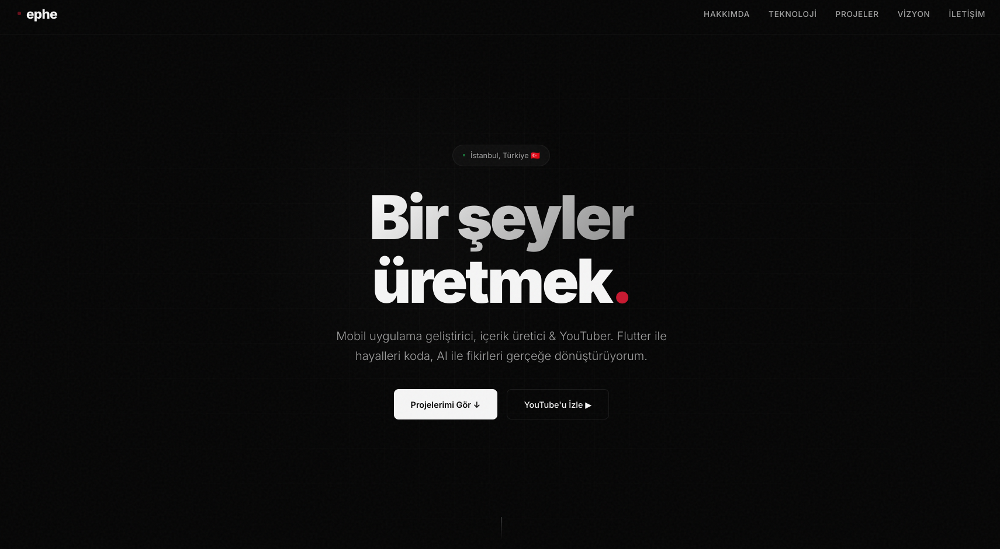
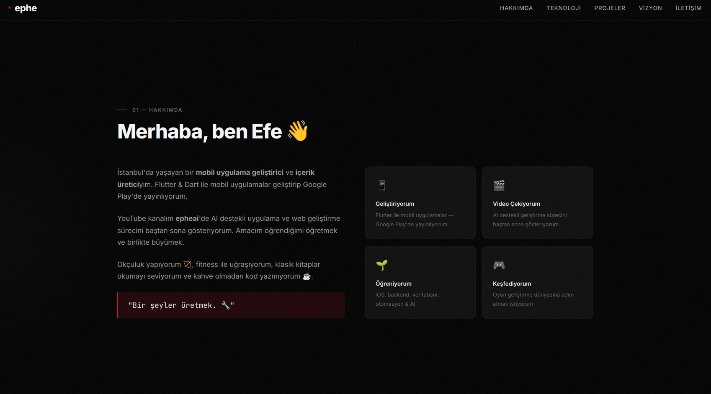
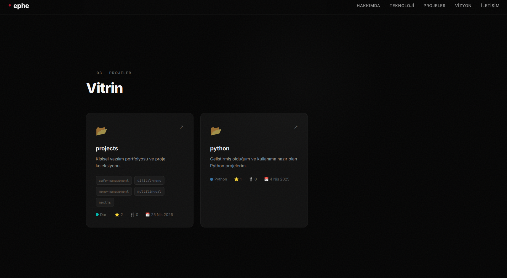
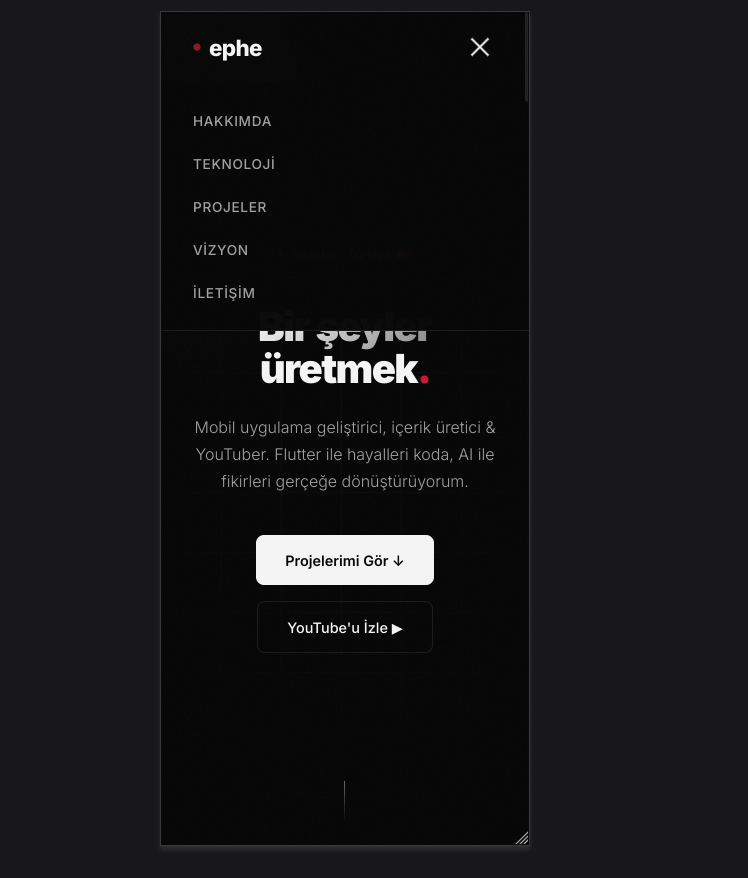

# Ephe Portfolio

Modern, responsive and interactive personal portfolio site for Efe (`ephe`). It presents profile details, technology stack, GitHub projects, social links and a small archery interaction in a polished single-page layout.

## Preview



## Screenshots







## Features

- Responsive single-page portfolio layout
- Animated hero, reveal effects and custom cursor glow
- GitHub repositories loaded from the GitHub public API
- Technology stack cards with Devicon assets
- Interactive archery canvas section
- Contact cards for GitHub, YouTube, Instagram and email

## Tech Stack

- HTML5
- CSS3
- JavaScript
- GitHub REST API
- Devicon CDN

## Run Locally

This is a static website, so it can be opened directly in a browser. For a local server:

```bash
python3 -m http.server 5173
```

Then open:

```text
http://localhost:5173
```

## Project Structure

```text
.
├── index.html
├── script.js
├── style.css
├── assets/
│   └── screenshots/
└── README.md
```

## Deployment

The project is ready for GitHub Pages. Use the repository root as the Pages source.

## License

No license has been added yet. Add one before allowing reuse, modification or distribution by others.
